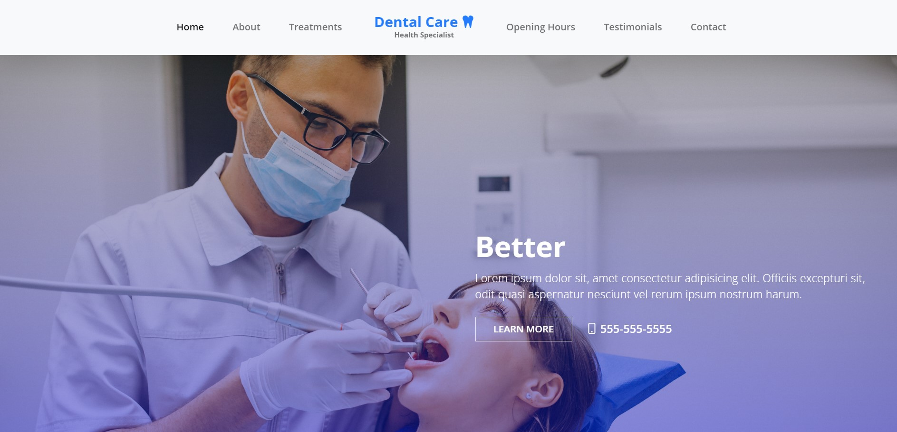

# Dentist Website

[Dentist Website](https://sude-go.github.io/Dentist-Website/), is a simple website that can be used by any dentist to promote their clinic.
  

## :star: Features
- You can see the list of doctors and their specialties.
- You can contact the clinic by phone, email, or social media.
- You can learn more about the dental services and treatments offered by the clinic.
- You can view the testimonials and ratings from previous patients.
 
 

## :computer: Tools and Technologies

  
 

 

 
 